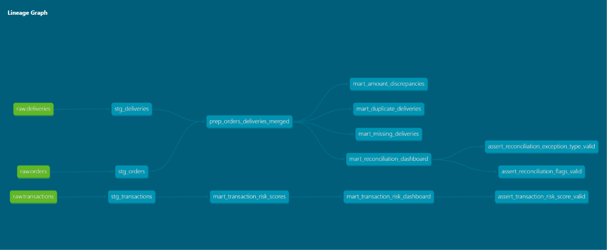
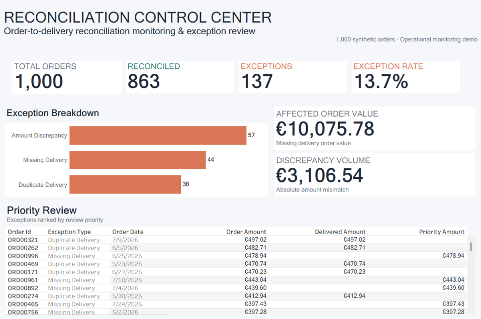
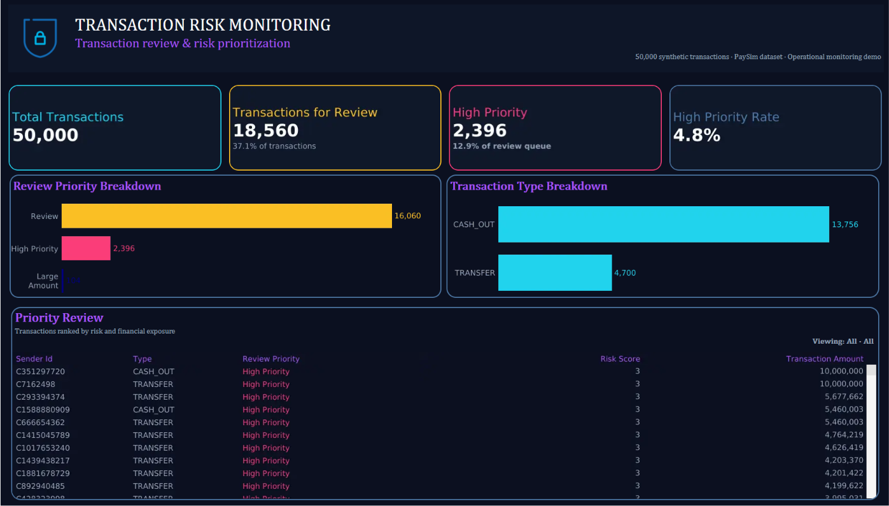

# Operational Reconciliation & Transaction Risk Monitoring

An analytics engineering portfolio project demonstrating two operational
control use cases:

1. **Order-to-delivery reconciliation** — identifying missing records,
   amount discrepancies, and duplicate deliveries.
2. **Transaction risk monitoring** — using validated rule-based signals
   to prioritize financial transactions for operational review.

The project uses Python, DuckDB, dbt, SQL, and Tableau to move from raw
data through tested transformation layers to interactive operational
dashboards.

## Why this project

Operational teams often need to answer two related questions:

- **Do records across systems reconcile correctly?**
- **Which records should be investigated first?**

This project explores both problems through separate use cases while using
the same general analytics engineering principles: explicit business rules,
reproducible transformations, data quality testing, and business-ready
reporting layers.

---

## Architecture

```text
Raw CSV data
     ↓
Python / DuckDB ingestion
     ↓
dbt staging
(cleaning + explicit data types)
     ↓
dbt prep
(business logic / signal preparation)
     ↓
dbt marts
(operational outputs)
     ↓
Tableau
(interactive monitoring)
```

Business rules are defined upstream and reused by downstream marts rather
than being independently reimplemented in each report.



---

## Case Study 1 — Order-to-Delivery Reconciliation

A reproducible synthetic dataset of **1,000 orders** was generated with
Faker. Missing delivery records, amount discrepancies, and duplicate
delivery records were intentionally introduced.

The reconciliation pipeline produces one order-level record with consistent
exception flags and status.

### Results

| Exception Type | Orders | Share |
|---|---:|---:|
| Missing Delivery | 44 | 4.4% |
| Amount Discrepancy | 57 | 5.7% |
| Duplicate Delivery | 36 | 3.6% |
| **Total Exceptions** | **137** | **13.7%** |

Additional operational metrics:

- **3,106.54** total absolute amount discrepancy
- **10,075.78** order value associated with missing delivery records

The affected order value represents value requiring investigation, not
confirmed financial loss.

[Read the full reconciliation case study](case_studies/ecommerce_case.md)

### Tableau dashboard

**Order-to-Delivery Reconciliation Control Center**

Interactive monitoring of reconciliation status, exception categories,
financial impact, and records requiring investigation.



[View dashboard on Tableau Public](https://public.tableau.com/app/profile/oleksandra.horbach/viz/Order-to-DeliveryReconciliationControlCenter/Dashboard1)

---

## Case Study 2 — Transaction Risk Monitoring

A **50,000-transaction PaySim sample** was used to explore simple
transaction characteristics against the ground-truth `isFraud` label.

Candidate signals were evaluated individually before inclusion in the
operational risk score.

The final score uses:

| Signal | Weight |
|---|---:|
| Risky transaction type (`CASH_OUT` / `TRANSFER`) | 2 |
| Amount above sample P95 | 1 |

This produces a transparent risk score from **0 to 3**.

### Risk score validation

| Risk Score | Transactions | Fraud Cases | Fraud Rate |
|---|---:|---:|---:|
| 0 | 31,440 | 0 | 0.000% |
| 1 | 104 | 0 | 0.000% |
| 2 | 16,060 | 85 | 0.529% |
| 3 | 2,396 | 15 | 0.626% |

All observed fraud cases in the sample fall within scores 2 and 3.

The separation between scores 2 and 3 is modest, so this is **not presented
as a predictive fraud model**. The score is designed as a transparent
rule-based mechanism for prioritizing operational review.

### Signal validation lesson

Sender balance mismatch was also evaluated as a candidate signal.

Although intuitively plausible, it showed an inverse relationship with the
fraud label in this sample and was therefore excluded from the final score.

This reinforced an important design principle: candidate rules should be
validated individually before being combined into a composite score.

[Read the full transaction risk case study](case_studies/fintech_case.md)

### Tableau dashboard

**Transaction Risk Monitoring**

Interactive transaction segmentation and review prioritization by risk
score, review priority, and transaction type.


[View dashboard on Tableau Public](https://public.tableau.com/app/profile/oleksandra.horbach/viz/TRANSACTIONRISKMONITORING/Dashboard1)

---

## Data Quality & Validation

The dbt project includes both generic data quality tests and custom
business-rule tests.

Examples include:

- uniqueness and non-null validation;
- accepted values for risk scores and review priorities;
- reconciliation flag consistency;
- reconciliation status consistency;
- weighted risk-score consistency.

For example, the transaction risk test verifies that:

```sql
risk_score =
    flag_risky_type * 2
    + flag_large_amount
```

This helps ensure that dashboard outputs remain consistent with the
underlying business rules.

---

## Tech Stack

- **Python** — synthetic data generation and exploratory validation
- **pandas / Faker** — data generation
- **DuckDB** — local analytical database
- **SQL** — analysis and transformation logic
- **dbt-core + dbt-duckdb** — staging, preparation, marts, documentation,
  and testing
- **Jupyter Notebook** — analytical validation
- **Tableau** — operational monitoring dashboards

---

## Project Structure

```text
reconciliation-toolkit/
│
├── case_studies/
│   ├── ecommerce_case.md
│   └── fintech_case.md
│
├── dashboard/
│   ├── reconciliation_dashboard.png
│   └── transaction_risk_dashboard.png
│
├── data/
│   ├── orders.csv
│   ├── deliveries.csv
│   └── transactions_sample.csv
│
├── dbt_reconciliation/
│   ├── models/
│   │   ├── staging/
│   │   ├── prep/
│   │   └── mart/
│   ├── tests/
│   └── dbt_project.yml
│
├── docs/
│   └── lineage_graph.png
│
├── notebooks/
│   ├── order_to_delivery_exploration.ipynb
│   └── PaySim_exploration.ipynb
│
├── python/
│   ├── generate_data.py
│   └── setup_db.py
│
├── .gitignore
├── requirements.txt
└── README.md
```

Generated DuckDB databases, dbt build artifacts, logs, and dashboard export
CSVs are excluded from version control.

---

## How to Run

Install dependencies:

```bash
pip install -r requirements.txt
```

Generate the reproducible synthetic order/delivery dataset:

```bash
python python/generate_data.py
```

Load source CSVs into DuckDB:

```bash
python python/setup_db.py
```

Run the dbt project:

```bash
cd dbt_reconciliation

dbt build
```

Generate dbt documentation:

```bash
dbt docs generate
dbt docs serve
```

---

## Data Sources

The order-to-delivery dataset is generated synthetically within this
repository using Faker and a fixed random seed.

The transaction-risk case uses a 50,000-row sample of the **PaySim synthetic
financial transaction dataset**. PaySim simulates mobile-money transactions
and includes fraud labels that are used here only to validate the behaviour
of candidate operational risk signals.

The original PaySim dataset is available on Kaggle:
https://www.kaggle.com/datasets/ealaxi/paysim1

---

## Scope & Limitations

This project is designed as an analytics engineering and operational
monitoring exercise.

The transaction risk score is rule-based and was validated on a sample of
synthetic transaction data. It should not be interpreted as a production
fraud detection model.

Similarly, reconciliation exceptions indicate records requiring
investigation; they do not by themselves establish financial loss,
fraud, or operational failure.